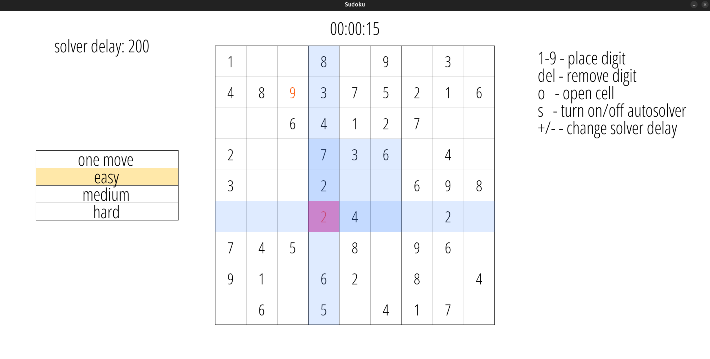
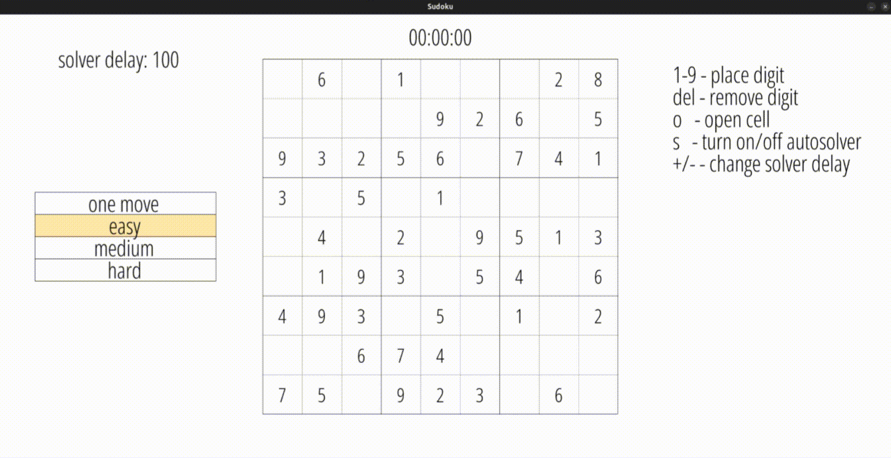

# Sudoku
Simple Sudoku application built with SDL2.


Solver demonstration (uses backtracking algorithm)


## Dependencies
- C Compiler
- git
- CMake 3.20 or newer
- SDL2 library
- SDL2_ttf library

## How to build and run

### Linux
#### 1. Install Dependencies
On Debian/Ubuntu based distributions, use the following command:
```bash
sudo apt update
sudo apt install build-essential git cmake libsdl2-dev libsdl2-ttf-dev
```

#### 2. Clone Repository
```bash
git clone https://github.com/Thermirino/sudoku.git
cd sudoku
```

#### 3. Configure and Build
```bash
cmake --preset unix-release
cmake --build --preset unix-release
```

#### 4. Run
```bash
./build/release/bin/app
```

### Windows
#### 1. Install Visual Studio 2022, Git, Cmake

#### 2. Install Vcpkg
```bash
git clone https://github.com/microsoft/vcpkg.git
cd vcpkg
.\\bootstrap-vcpkg.bat
```

Configure the VCPKG_ROOT environment variable.

- Temporary (current terminal session only)
  
  In PowerShell:
```bash
$env:VCPKG_ROOT = "C:\path\to\vcpkg"
```

- Permanent (User or System-wide)
  
  Using Windows GUI (System Environment Variables panel)

#### 3. Clone Repository
```bash
git clone https://github.com/Thermirino/sudoku.git
cd sudoku
```

#### 4. Configure and Build
```bash
cmake --preset vs
cmake --build --preset vs-release
```

### 5. Run
```bash
build\bin\Release\app
```
